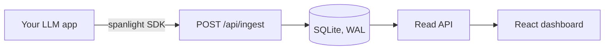

# spanlight

[](https://github.com/Antheagao/spanlight/actions/workflows/ci.yml)

Self-hosted LLM observability: traces, spans, token and cost accounting, and latency stats for LLM applications.
One small server, one dashboard, zero vendor accounts.

Tools like Langfuse and LangSmith do this well as hosted products.
spanlight exists for the cases where your prompts and completions should not leave your machine: it is a single `pip install`, backed by SQLite, with no API keys, no sign-up, and no data egress.

## What you get

- **Tracing**: group the work behind one request (LLM calls, retrieval, tool use) into a trace of timed spans.
- **Cost and token accounting**: every LLM span carries input/output tokens and cost; the API aggregates both per trace and per model.
- **Latency stats**: p50/p95 latency and error rates per model.
- **Timeseries**: calls, tokens, cost, and errors over time, bucketed for charting.
- **A local dashboard** (in progress): a React UI over the same read API.

## Quickstart

```bash
pip install -e .
python -m spanlight.server   # serves on http://127.0.0.1:4318
```

Send a trace:

```bash
curl -s -X POST http://127.0.0.1:4318/api/ingest -H 'content-type: application/json' -d '{
  "traces": [{"id": "t1", "name": "chat-request", "started_at": 1700000000.0, "ended_at": 1700000001.6}],
  "spans": [{"id": "s1", "trace_id": "t1", "name": "llm:haiku", "kind": "llm",
             "started_at": 1700000000.1, "ended_at": 1700000001.5,
             "model": "haiku", "input_tokens": 420, "output_tokens": 180, "cost_usd": 0.0011}]
}'
```

Read it back:

```bash
curl -s http://127.0.0.1:4318/api/traces          # newest-first summaries with aggregates
curl -s http://127.0.0.1:4318/api/traces/t1       # full span tree
curl -s http://127.0.0.1:4318/api/stats/models    # per-model tokens, cost, p50/p95 latency
```

## API

| Endpoint | Purpose |
|---|---|
| `POST /api/ingest` | Batch-upsert traces and spans (the SDK reports a trace at open and again at close). |
| `GET /api/traces?limit&before&q` | Newest-first trace summaries with span/token/cost aggregates, cursor-paged. |
| `GET /api/traces/{id}` | One trace with its spans in order. |
| `GET /api/stats/models?since` | Per-model calls, errors, tokens, cost, p50/p95 latency. |
| `GET /api/stats/timeseries?since&bucket_seconds` | Calls, tokens, cost, errors over time. |
| `GET /healthz` | Database round-trip check. |

There is deliberately no auth: spanlight is a dev-tools daemon for localhost or a private network, not a multi-tenant service.

## Architecture



SQLite is deliberate: a self-hosted, single-team tool should install in seconds and keep its data in one file.
The server opens one serialized connection (CPython's `sqlite3` is compiled thread-safe) and every ingest batch commits atomically.

## Development

```bash
pip install -e ".[dev]"
pytest          # API tests over a temp database
ruff check .
```

## Roadmap

- [x] Server: ingest + traces + model stats + timeseries (tested, CI)
- [ ] Python SDK: `with trace(...)` / span context managers, cost table, buffered flush
- [ ] React dashboard: trace list, span waterfall, model stats, cost over time
- [ ] Demo seeder so the dashboard renders without any LLM keys
- [ ] OpenTelemetry bridge: mirror spans to any OTLP collector

## License

MIT
